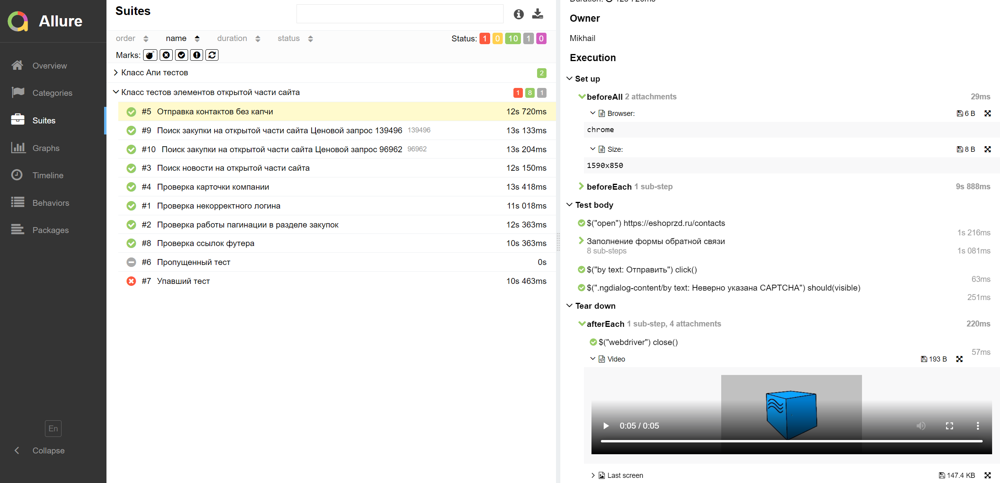

# Проект по автоматизации тестирования сайта электронного магазина ОАО "РЖД"
<a target="_blank" href="https://eshoprzd.ru/">Сайт проекта</a>

## :world_map: Содержание
- [Технологии и инструменты](#earth_africa-технологии-и-инструменты)
- [Примеры UI тестов](#pager-Примеры-UI-тестов)
- [Примеры API тестов](#scroll-Примеры-API-тестов)
- [Сборка в Jenkins с параметрами](#-Сборка-в-Jenkins-с-параметрами)
- [Allure отчет](#-Allure-отчет)
- [Отчет в Telegram с помощью бота](#-Отчет-в-Telegram-с-помощью-бота)
- [Видео прохождения тестов на Selenoid](#film_projector-Видео-прохождения-тестов-на-Selenoid)

## :earth_africa: Технологии и инструменты

В данном проекте автотесты написаны на <code>Java</code> с использованием <code>Selenide</code> для UI-тестов и <code>Rest Assured</code> для API тестов
>
> <code>Selenoid</code> выполняет запуск браузеров в контейнерах <code>Docker</code>.
>
> <code>Allure Report</code> формирует отчет о запуске тестов.
>
> Для автоматизированной сборки проекта используется <code>Gradle</code>.
>
> В качестве библиотеки для модульного тестирования используется <code>JUnit 5</code>.
>
> <code>Jenkins</code> выполняет запуск тестов.
> После завершения прогона отправляются уведомления с помощью бота в <code>Telegram</code>.

## :pager: Примеры UI тестов
- Проверка работоспособности ссылок футера страницы
- Проверка авторизации на сайте
- Проверка поиска сущностей на сайте
- Проверка работы пагинации
- Проверка работоспособности капчи

## :scroll: Примеры API тестов
- Проверка поиска сущностей и разбор тела ответа

## </a> Сборка в Jenkins с параметрами
>
> В сборке присутствуют настраиваемые параметры.
>
> Например размер запускаемого браузера или тип браузера. Сами тесты запускаются удаленно с помощью <code>Selenoid</code>

## </a> Allure отчет
>
> Allure формирует подробный отчет о прогоне тестов. Кастомные фильтры и листенеры делают отчет максимально понятным
>
> Например в отчет пишутся все селекторы и методы <code>Selenide</code>, отчеты формируются по категориям, в конце приложен скриншот, видео запись прогона теста и логи
Для API тестов полностью указаны данные запроса/ответа

##  Отчет в Telegram с помощью бота

## :film_projector: Видео прохождения тестов на Selenoid

<h2>
  :crystal_ball: Всю сборку можно запустить самостоятельно https://jenkins.autotests.cloud/job/mipkasnow-QaGuru-Diploma-Project-UI/ (необходимо предварительно  зарегистрироваться)
  Отчет в телеграм придет в чат https://t.me/+z08EK641X7dmNjZi
</h2>
